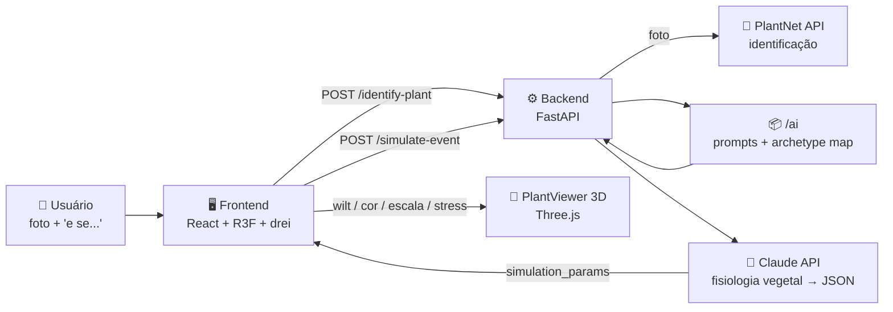

Skip to content
BryanMoreira0717
PlantLab
Repository navigation
Code
Issues
Pull requests
Agents
Actions
Projects
Wiki
Security and quality
Insights
Settings
PlantLab
/
readme.md
in
main

Edit

Preview
Indent mode

Spaces
Indent size

2
Line wrap mode

No wrap
Editing readme.md file contents
Selection deleted
  1
  2
  3
  4
  5
  6
  7
  8
  9
 10
 11
 12
 13
 14
 15
 16
 17
 18
 19
 20
 21
 22
 23
 24
 25
 26
 27
 28
 29
 30
 31
 32
 33
 34
 35
 36
 37
 38
 39
 40
 41
 42
 43
 44
 45
 46
 47
 48
 49
 50
 51
 52
 53
 54
 55
 56
 57
 58
 59
 60
 61
 62
 63
 64
 65
 66
 67
 68
 69
 70
 71
 72
 73
 74
 75
 76
 77
 78
 79
 80
 81
 82
 83

  

  
  
  
  

  <b>🇧🇷 Ferramenta educativa que mostra — em texto + modelo 3D — o que aconteceria com uma planta ao sofrer um fenômeno qualquer.</b> 
  <i>Ex.: “e se eu jogar 12 litros de água de uma vez no manjericão?” → explicação biológica + planta 3D murchando/amarelando ao longo dos dias.</i>

---

## 📑 Índice

- [🌿 Sobre](#-sobre)
- [✨ Como funciona](#-como-funciona)
- [🛠️ Tecnologias](#️-tecnologias)
- [📁 Estrutura do projeto](#-estrutura-do-projeto)
- [🗺️ Roadmap](#️-roadmap)
- [🚀 Como rodar](#-como-rodar)
- [🔑 Variáveis de ambiente](#-variáveis-de-ambiente)
- [🧪 Como testar cada etapa](#-como-testar-cada-etapa)
- [👥 Equipe](#-equipe)
- [⚠️ Aviso educativo](#️-aviso-educativo)
- [📄 Licença](#-licença)

---

## 🌿 Sobre

O **PlantLab 3D** nasceu de uma ideia simples e poderosa: o usuário quer cuidar de plantas, mas não sabe como — e tem medo de errar.

Em vez de ler um manual chato de botânica, ele:

1. 📸 **Identifica a planta** — envia uma foto ou digita o nome;
2. 💭 **Descreve um “e se...” em texto livre** — *“e se eu deixar 7 dias sem luz?”*, *“e se eu botar 12L de água de uma vez?”*;
3. 📖 **Recebe uma explicação biológica** gerada por LLM (Anthropic Claude);
4. 🌵 **Vê um modelo 3D reagindo** — murcha, muda de cor, cresce/encolhe, mostra estresse;
5. ⏳ **Arrasta uma linha do tempo** (dia 0 → dia N) e compara dois cenários lado a lado.

> Projeto de feira agora, produto de verdade depois. 🌱🚀

---

## ✨ Como funciona

**Exemplo real de fluxo:**

| Etapa | Entrada | Saída |
|-------|---------|-------|
| 🪴 Identificar | foto de manjericão | `Ocimum basilicum` · confiança 0.92 · arquétipo `folha_larga` |
| 🌊 Simular | *“12 litros de água de uma vez”* | explicação PT-BR + `{wilt: 0.3, cor: amarelado, crescimento: -0.2, stress: true, dias: 7}` |
| 🌵 Visualizar | `simulation_params` | modelo `folha_larga.glb` murcha 30%, amarela, encolhe, com ⚠️ |

---

## 🛠️ Tecnologias

  

Use Control + Shift + m to toggle the tab key moving focus. Alternatively, use esc then tab to move to the next interactive element on the page.
Nenhum arquivo escolhido
Attach files by dragging & dropping, selecting or pasting them.
 